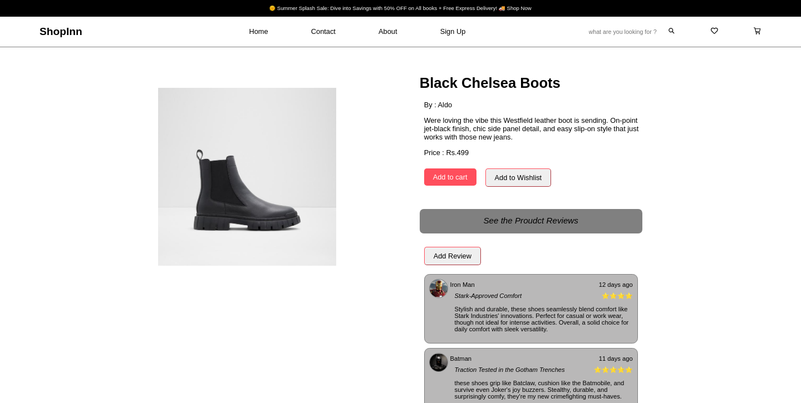

# shopInn a fullstack e-commerce application

### Stack

  HTML5 | CSS3 | Javascript | React.js | Redux | Redux-thunk |
  Redux-Persist | Axios | JsonWebToken | Node.js | Mongodb 
  Mongoose | express.js | Multer | Cloudinary |
  Bcrypt | Cors | Dotenv | Razorpay

  -- Node.js version : v20.10.0
  -- React-router    : v6.20.1

# File Structure:

        ShopInn
        |
        |----- backend/
        |         |----- config/
        |         |         |----- db.js
        |         |----- controllers/
        |         |         |----- productController.js
        |         |         |----- userController.js
        |         |         |----- adminController.js 
        |         |         |----- paymentController.js 
        |         |----- middleware/
        |         |         |----- authorization.js
        |         |         |----- multer.middleware.js
        |         |----- models/
        |         |         |----- addressmodel.js
        |         |         |----- blacklistmodel.js
        |         |         |----- cartmodel.js
        |         |         |----- ordermodel.js
        |         |         |----- paymentmodel.js
        |         |         |----- productmodel.js
        |         |         |----- reviewmodel.js
        |         |         |----- usermodel.js
        |         |         |----- userUpdatemodel.js
        |         |         |----- wishlistmodel.js
        |         |----- public/
        |         |----- temp/
        |         |----- routes/
        |         |         |----- productRoutes.js
        |         |         |----- userRoutes.js   
        |         |         |----- adminRoutes.js   
        |         |         |----- paymentRoutes.js   
        |         |----- utils/
        |         |         |----- cloudinary.js
        |         |         |----- admiCloudinary.js
        |         |
        |         |----- index.js
        |         |----- pakage-lock.json
        |         |----- package.json
        |  
        |----- frontend/
        |         |----- public/
        |         |         |----- index.html
        |         |----- src/
        |         |         |----- Admin/
        |         |         |         |----- Component/
        |         |         |         |         |----- Adminnavbar/
        |         |         |         |         |----- Books/
        |         |         |         |         |----- Electronics/
        |         |         |         |         |----- Shoes/
        |         |         |         |         |----- UserCard/                                
        |         |         |         |----- Pages/
        |         |         |         |         |
        |         |         |         |         |-----  Addproducts/
        |         |         |         |         |-----  Dashboard/
        |         |         |         |         |-----  Productupdate/
        |         |         |----- assets/
        |         |         |----- Component/
        |         |         |         |----- BookCard/
        |         |         |         |----- CartProduct/
        |         |         |         |----- Category/
        |         |         |         |----- Footer/
        |         |         |         |----- Hero/
        |         |         |         |----- Loader/   
        |         |         |         |----- MobileCard/
        |         |         |         |----- Myorder/
        |         |         |         |----- Navbar/
        |         |         |         |----- Offer/       
        |         |         |         |----- PartLoader/
        |         |         |         |----- Private/
        |         |         |         |----- Profile/
        |         |         |         |----- ShoeCard/
        |         |         |         |----- Today/                                                  
        |         |         |----- Config/
        |         |         |----- Context/                   
        |         |         |----- Pages/
        |         |         |         |----- About/     
        |         |         |         |----- Books/         
        |         |         |         |----- Cart/            
        |         |         |         |----- Home/               
        |         |         |         |----- Login/      
        |         |         |         |----- Mobile/     
        |         |         |         |----- Mypurchase/
        |         |         |         |----- Product/       
        |         |         |         |----- Reviews/       
        |         |         |         |----- Shoes/        
        |         |         |         |----- Signup/      
        |         |         |         |----- Wishlist/                              
        |         |         |----- Redux/
        |         |         |         |----- LoaderReducer/           
        |         |         |         |----- ProductReducer/ 
        |         |         |----- App.css
        |         |         |----- App.jsx
        |         |         |----- index.js
        |         |         |----- package-lock.json
        |         |         |----- package.json
        |
        |

##### Environment Variables
        |
        |----- .env  
        |       MongoURI = "YOUR_MONGODB_URI" 
        |       secret   =  "Your Secret"
        |       PORT     =  4500
        |       salt_rounds = Number range
        |       CLOUDINARY_CLOUD_NAME = "YOUR_CLOUDINARY_CLOUD_NAME" 
        |       CLOUDINARY_API_KEY    = "YOUR_CLOUDINARY_API_KEY" 
        |       CLOUDINARY_API_SECRET = "YOUR_CLOUDINARY_API_SECRET" 
                

##### Testing Card for payment
     Mastercard	Domestic	5267 3181 8797 5449
     Visa	       Domestic      4111 1111 1111 1111

##### User Routes 
       |
       |----- http://localhost:4500/  || Your Server URL
       |
       |----- http://localhost:4500/api/user/register      
       |----- http://localhost:4500/api/user/login          
       |----- http://localhost:4500/api/user/logout
       |----- http://localhost:4500/api/user/settings
       |----- http://localhost:4500/api/user/profile_picture/:id
       |----- http://localhost:4500/api/user/products/review/:id
       |----- http://localhost:4500/api/user/update_profile_info
       |----- http://localhost:4500/api/user/update_address_info
       |

##### Products Routes 
       |
       |----- http://localhost:4500/  || Your Server URL
       |
       |----- http://localhost:4500/api/products/products
       |----- http://localhost:4500/api/products/product_details/:id
       |----- http://localhost:4500/api/products/wishlist/add_product
       |----- http://localhost:4500/api/products/wishlist/get_products/:id;
       |----- http://localhost:4500/api/products/wishlist/remove_product/:id
       |----- http://localhost:4500/api/products/cart/add_to_cart
       |----- http://localhost:4500/api/products/cart/get_cartdata/:id
       |----  http://localhost:4500/api/products/cart/remove_cart_items/:id
       |----  http://localhost:4500/api/products/reviews/get_all_reviews
       |----  http://localhost:4500/api/products/reviews/delete_review
       |----  http://localhost:4500/api/products/category/:category/page/:pagenumber
       |----  http://localhost:4500/api/products/category/:category/subcategory/:subcategory/page/:pagenumber
       |----  http://localhost:4500/api/products/order_details
       |----  http://localhost:4500/api/products/purchase_items

##### Admin Routes 
       |
       |----- http://localhost:4500/  || Your Server URL
       |----- http://localhost:4500/api/admin/alluser
       |----- http://localhost:4500/api/admin/add_product
       |----- http://localhost:4500/api/admin/update_product
       |----- http://localhost:4500/api/admin/delete_product
       |----- http://localhost:4500/api/admin/products/:category
       |----- http://localhost:4500/api/admin/product_details/:id
       |----- http://localhost:4500/api/admin/update/product_image
       |----- http://localhost:4500/api/admin/dashboard/counts
     

##### Payment Routes 
       |
       |---- http://localhost:4500/api/get_key 
       |----  http://localhost:4500/api/accept_payment
       |----  http://localhost:4500/api/payment_verification

##### Features 
  
    -- USER SIDE FEATURE
         -- User registration.
         -- User login.
         -- User logout.
         -- User settings.
         -- User profile picture upload/update.
         -- Product review submission for a specific product.
         -- Update user profile information.
         -- Update user address information.
         -- Retrieve all products.
         -- Retrieve details of a specific product.
         -- Add a product to the wishlist.
         -- Retrieve wishlist items for a specific user.
         -- Remove a product from the wishlist.
         -- Add a product to the cart.
         -- Retrieve cart data for a specific user.
         -- Remove items from the cart.
         -- Retrieve all product reviews.
         -- Delete a product review.
         -- Retrieve products by category and page number.
         -- Retrieve products by category, subcategory, and page number.
         -- Retrieve order details.
         -- Purchase items.
         -- Retrieve payment key.
         -- Accept payment.
         -- Payment verification.
         -- Pagination
         -- Pagination Navigation
         -- Category Filtering
         -- Sorting by Price
         -- Filtering by Price Range
         -- Checkbox Handling/filtering
         -- Token Blacklisting

    -- ADMIN SIDE FEATURE     

         -- Retrieve all users.
         -- Add a new product.
         -- Update product information.
         -- Delete a product.
         -- Retrieve products by category.
         -- Retrieve details of a specific product for admin.
         -- Update product image.
         -- Dashboard: Retrieve counts of various entities (e.g., users, products).

##### Landing page

##### Signup page

  

##### login page
      
     

##### category page
   

##### Single Product page 
  

##### wishlist page 
  
 
 ##### cart page 
  

 ##### order page 
  

 ##### payment page 
  

 ##### setting page 
  

 ##### all reviews page 
  

 
